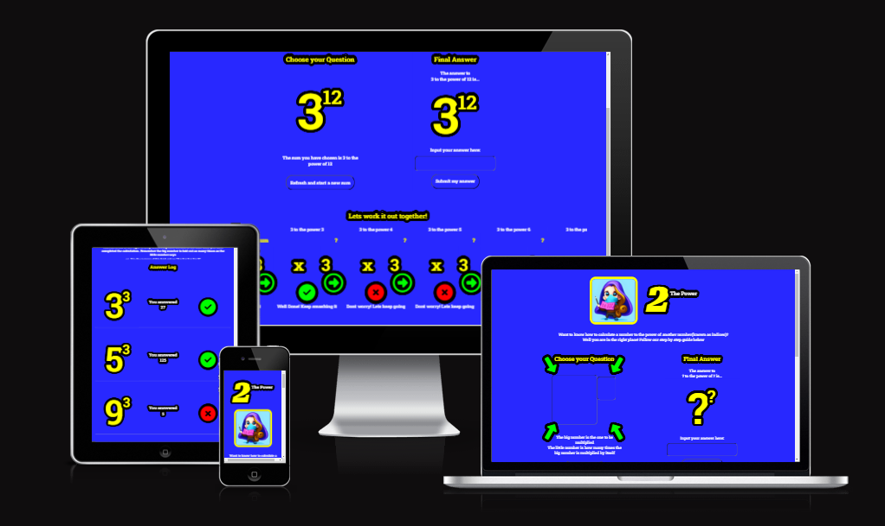
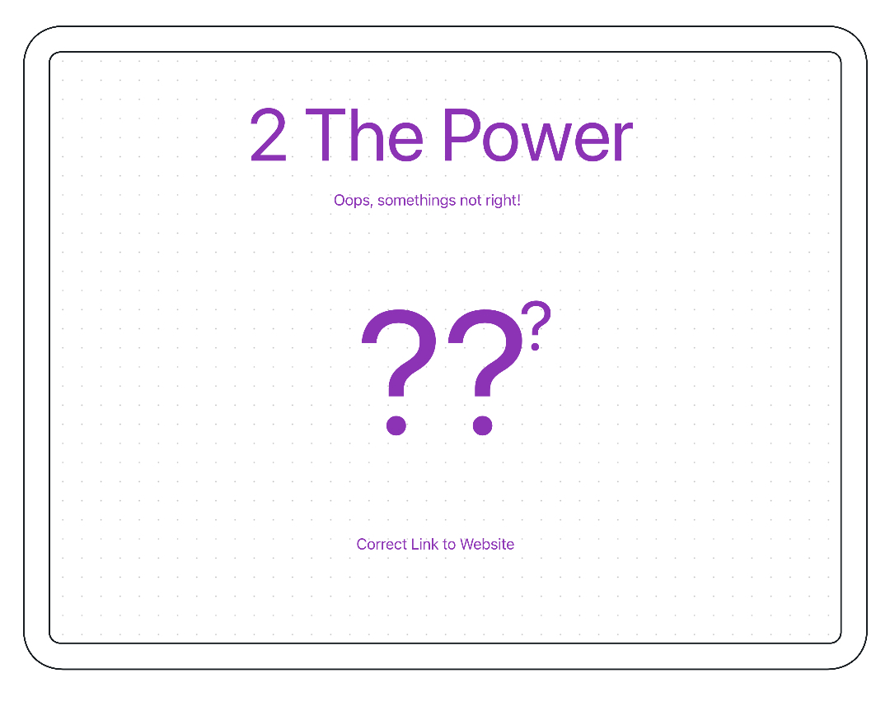
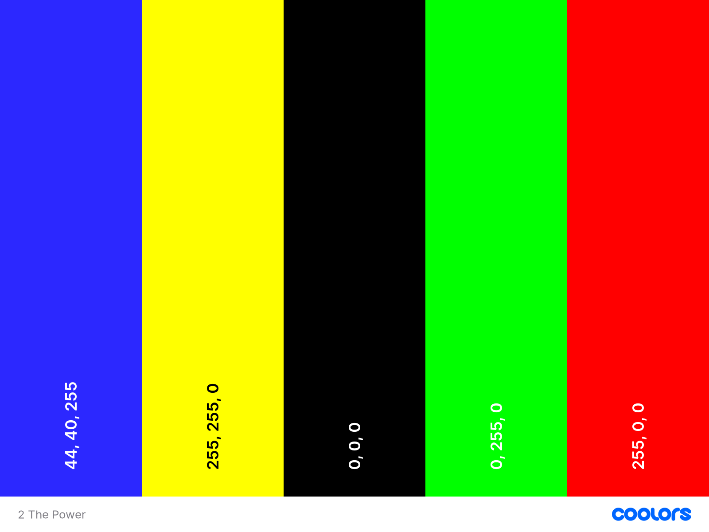
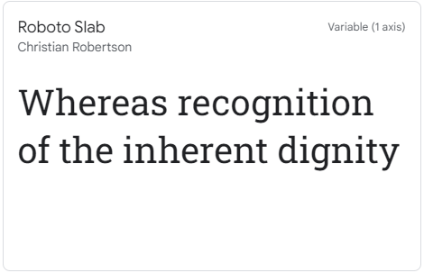
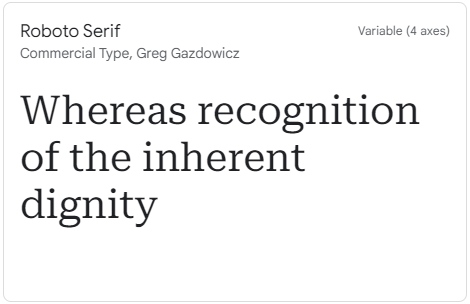
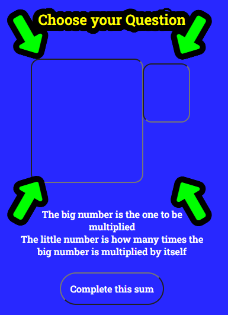
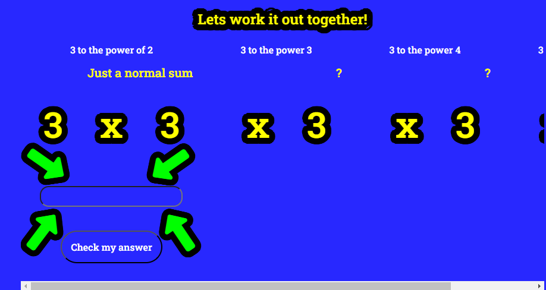
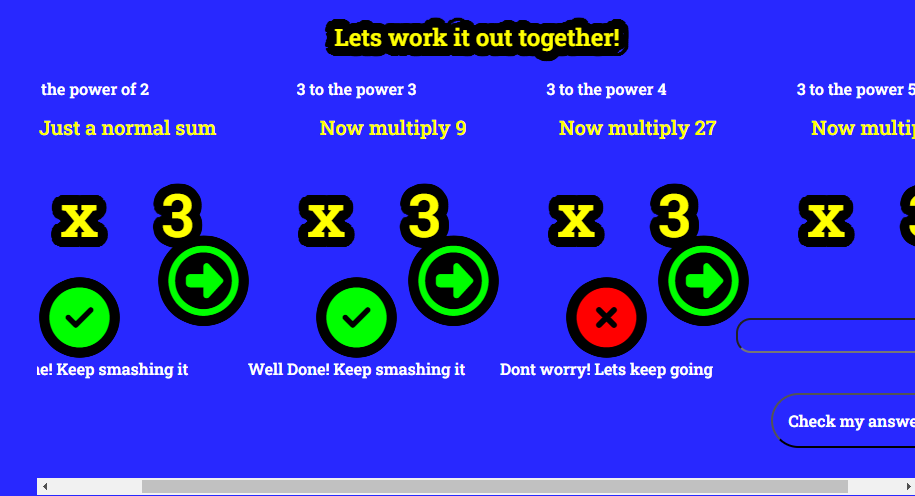
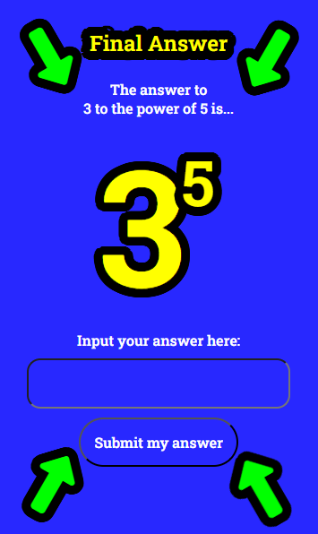
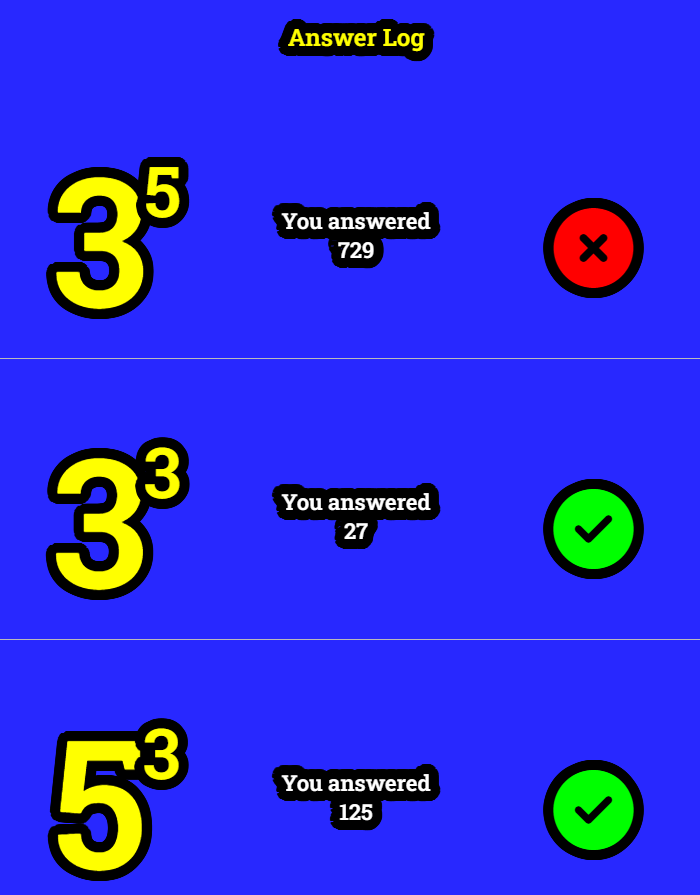

# 2 The Power: An easy to use maths teaching aid

Welcome to 2 The Power, a website aimed at children and adults who want to learn how to calculate indices. Our website utilizes very accessible colors, blue and yellow, and uses bold aesthetics to make learning fun and engaging.

This website was inspired by teaching one of my three daughters a couple of months ago. She found this method to be an easy way to calculate indices, and I wanted to share it with others who may struggle with this topic.

Our goal is to make learning easy and accessible for everyone. We believe that everyone can learn, and we want to provide a platform for individuals to do so.

Thank you for choosing 2 The Power as your learning resource. We hope you enjoy your experience on our website and gain valuable knowledge that will help you in your academic and personal life

Links to Git hub repository and live site pages below

[Git Hub Repo - 2 The Power](https://github.com/Bowlesy666/2thepower)

[Live deployed site - 2 The Power](https://bowlesy666.github.io/2thepower/)

[Live deployed site - 404 page](https://bowlesy666.github.io/2thepower/404.html)

___

## Contents

* [UX](#UX)
  * [User Stories](#User-Stories)

* [Design](#design)
  * [Wireframes](#wireframes)
  * [Colour Scheme](#colour-scheme)
  * [Typography](#typography)
  * [Imagery](#imagery)

* [Features](#features)
  * [General Features](#general-features)
  * [Future Implementations](#future-implementations)
  * [Accessibility](#accessibility)

* [Technologies Used](#technologies-used)
  * [Languages Used](#languages-used)
  * [Frameworks, Libraries & Programs Used](#frameworks-libraries--programs-used)

* [Deployment & Local Development](#deployment--local-development)
  * [Deployment](#deployment)
  * [Local Development](#local-development)
    * [How to Fork](#how-to-fork)
    * [How to Clone](#how-to-clone)

* [Testing](#testing)

* [Credits](#credits)
  * [Code Used](#code-used)
  * [Content](#content)
  * [Media](#media)
  * [Acknowledgments](#acknowledgments)

___

## UX

### User Stories

#### Target Audience

The target audience for "2 The Power" are:

* Aspiring young maths students looking to broaden their own knowledge
* Parents wishing to push and see progress in their childrens mathematics abilities
* Teachers wanting to find a fun way to engage students when calculating indices

#### Goals

The goals for "2 The Power" are:

* To offer an interactive exercise to reinforce learning and test understanding
* To provide a short how-to guide to calculating indices, including step-by-step instructions and taking users through the process.
* To provide a space for users to work out the sums and log their answers for progress tracking and review
* To provide a mobile first structure to the site for users who prefer to learn on ipads/tablets and parents phones

#### User Stories

* As a teacher, I want my students to practice calculating numbers to the power of another number so they can improve their math skills.
* As a young student, I want to learn how to calculate numbers to the power of another number so I can solve more difficult math problems.
* As a home schooler, I want my child to have access to an app that teaches them how to calculate numbers to the power of another number so they can learn at their own pace.
* As a tutor, I want to use an app that teaches how to calculate numbers to the power of another number to help my students who struggle with math.
* As an older student who struggles with maths, I want to use an app that teaches how to calculate indices and the steps I should take to work it out on my own so I can improve my confidence in math.

___

## Design

### WireFrames

Please see the link below for the wireframes markdown file, it shows the layout for the different screen sizes - mobile, ipad and laptop/desktop. it also shows how each of the 4 main panels were designed to look.

#### Index

The website contains one scrolling page, it is easy to navigate from section to section with the help of the focus() function but it also utilises green arrows that appear and disappear to make it even more obvious for those users who may need it

[Click Me - I am the Wireframes Link for the index page](wireframes.md)

#### 404

The 404 page is designed to be fun, keep the same colors and aesthetics and also carry on the theme of indices

### Colour Scheme

The website features a bold blue background (rgb(40, 40, 255)) that is sure to capture children's attention and make learning more engaging. The blue was made lighter slightly due to it being slightly overpowering on some mobiles during testing phases.

Throughout the website, you will find large and bold text in a vibrant yellow color (rgb(255, 255, 0)), which makes it easy for children to read and follow along. Outlines are displayed in black, providing a clear contrast against the blue background and white text provides the context.

The choice of Blue and yellow is significant as this is the most accesible combination of colours for thise with sight difficulties.

When users answer questions, they will receive immediate feedback in the form of green (rgb(0, 255, 0)) or red (rgb(255, 0, 0)) icons. Green indicates a correct answer, while red indicates an incorrect answer. This instant feedback helps users to learn from their mistakes and reinforces their understanding of mathematical concepts as well as instant and bold feedback.

We hope that the website will provide a fun and effective way for users to improve their maths skills.

### Typography

 We have chosen to use 'Roboto Slab' for the main text and 'Roboto Serif' for the title because of their unique characteristics and readability. These were utilised from google fonts.

 

Roboto Slab is a serif font that has a modern and clean look, making it easy to read on digital screens. It has a strong, bold appearance that helps to draw attention to the content. Additionally, it is a Google font that is widely available and compatible with different devices and browsers.

On the other hand, Roboto Serif is a font that has a classic and elegant look. It is a serif font that has a more traditional appearance, which makes it perfect for use in titles and headings. This font is also a Google font and has excellent legibility, which makes it easy to read even in smaller sizes.

Moreover, I have used a backup of 'serif' fonts because they are known to be more readable and easier on the eyes. Serif fonts have small lines or flourishes at the end of each stroke, which helps guide the reader's eyes from one letter to the next, making it easier to read and more attractive for younger users.

In conclusion, I have chosen 'Roboto Slab' for the main text, 'Roboto Serif' for the title and included a backup of serif fonts because of their unique characteristics and read ability. the main goal is to make the exerience available for everyone even those with sight or attention difficulties. 

### Imagery

The icon is the only image used in the website, the bold text with thick outlines was utilised as the main aesthetics designed to keep attention on the learning.

The image was created by Canva ai, we gave it instructions to create a "maths geek character for a maths app" after going through many other instructions. the yellow border was added with CSS to break up the lighter blue to the bold blue of the website background.

After checking Canva's ai text to image policy it was found that this is ok to use commercially

As you can see in the above the imagery of the text is big, bold and easy to take in. 

## Page Flow

### Scrolling Page

A single scrolling page has been utilised to eliminate distractions for users, the goal here is to teach in a fun and vibrant environment without links and images taking attention away.

The page flow follows each section in turn, it utilises focus() functions and green arrows that appear when the section is to be completed along with alert() functions that guide and feedback to the user. Icons are also displayed to feedback to the user what they have answered correct or incorrect

#### Logo and Title
On loading the site the user is met with the logo and title, underneath the title is the description for the site making it immediately evident what the site offers the user

#### Question Section

The next section is the question section, this allows the user to choose the question they would like to calculate, it is immediately eveident this is the section to complete first as the green arrows appear after the short timer gives an alert to instruct the user on the min and max paramters for this section.

#### Workings Out Section

The user is then directed to the workings out section with the green arrows now appearing here, although it is worth pointing out that the user can skip this step and go straight to final answer, this was designed so users who become more confident can try to calculate this without the need of the visual representation.

As you can see below the flow is controlled with the green arrows, only one input and button is available at a time in this section so there is no confusion Ps i got one wrong on purpose!

#### Final Answer Section

The final answer section can be filled in at any point after the question has been chosen, this is for users who have gained confidence at working this out in their head. The idea came from my daughter who inspired me to make this site. After teaching her this method she was able to work out 5 to the power of 12 in her head but would need to write down answers anything past this point, so the potential is there to utilise this feature

#### Answer History Log

The history log is the last section, this is auto completed after the final input is checked, this is to log the users progress that can be tracked by teachers, tutors, parents or grandparents.

___

## Features

### General Features

* built using mobile first style, responsive for larger screen sizes using flex box

* Is accessibility compliant utilising the most effective colours for this with sight isses or colour blindness

* The website features a bold logo and title which appeals to younger users 

* The sections are strategically placed to allow users to visualise the calculation process

* The page uses focus() and green arrows to direct the user to the relevent section 

* The website also includes favicons and a 404 page for improved user experience.

* The 404 page is in the style of "2 The Power" with the answer to 40 to the power of 4

* The website utilizes flexbox for layout styling

* The site uses media queries and CSS order property to change the order of the final answer section to below the workings out section on mobiles and above on larger screens

* The site uses input validation via html and Js - Js will pass error messages bacl to the html

* Utilises event listeners for click on the buttons

* Utilises event listeners for key press enter(This was taken from the love maths code along with Code Institute)

* hover effects

* Google fonts

* Font Awesome utilised for the icons

* Canva text to image ai technology used to create the logo image

### Future Implementations

I am overall happy with the design of the site! I feel the learning curve here was huge as I have never touched javascript before. Here are a couple of things that would boost the website given extra time

* Instead of alert() I would like to explore alternatives where I could add styles

* When the first correct answer is logged in the history I would like to produce a badge for the user, the user would be prompted with the next thresholds for further badges ie 5 correct, 10 correct

* Random numbers feature would be nice, I removed this as I thought it would be too close to the Love maths project

* Tooltips on hover or on click of inputs

* help buttons to explain in detail the calculation and process

* How to video, planned for my daughter to make a video to add in the footer which would take users through teh layout and features in a fun way(time constraints left me unable to complete this)

### Accessibility

I have been checking that the website is accessible friendly at every stage using Lighthouse and wave.webaim.org. I have also been mindful that I am:

* Using semantic HTML techniques.
* Using descriptive alt attributes on logo for the site.
* Providing clear direction and flow for the users with the use of bold icons and arrows.
* Ensuring that there is a sufficient colour contrast throughout the site, after researching in my previous project blue and yellow wasd shown to be the best colours to use together.
* Bold and colourful large text.
* Well spaced sections and big buttons allowing even the youngest and clumsiest of users to be able to use the site.

___

## Technology Used

### Languages Used

* HTML

* CSS

* Javascript

### Frameworks, Libraries & Programs Used

* Flexbox

* Canva text to image ai

* Google fonts

* Font Awesome

* Git for version control

* Github

* Gitpod

* Favicongenerator.org

* Coolors

* Am-i-responsive

* Mockup used for the wireframes, but will return to Balsamiq

* Google Dev Tools

* Validators - jshint, validator.w3.org, jigsaw.w3.org, wave.webaim.org

* Accesible colour checker - accesibleweb.com

* Stackoverflow - actually found that stackoverflow hasnt given me any direct answers as i dont understand the code that people put on there but it massively helped spark new things which in turn helped me solve problems

___

## Deployment and Local Development

### Deployment

I have deployed my project using GitHub Pages. Click this [link](https://bowlesy666.github.io/2thepower/) to view the deployed project.

To deploy the project I followed the below instructions:

1. Login or Sign Up to GitHub.
2. Open the project repository [here.](https://github.com/Bowlesy666/Tribute-Page-PP1)
3. Click on "Settings" on the navigation bar under the repository title.
4. Click on "Pages" in the left hand navigation panel.
5. In the Build and deployment section under "Source", choose which branch to deploy. This should be Main.
6. Choose which folder to deploy from, usually "/root".
7. Click "Save", then wait for it to be deployed. It can take some time for the page to be fully deployed and you may have to refresh the page after a couple of minutes.
8. Your URL will be displayed above "Source".
9. The prject will now be deployed

### Local Development

#### How to Fork

To fork the repository:

1. Log in (or sign up) to Github.
2. Go to the repository for this project, [Tribute-Page-PP1](https://github.com/Bowlesy666/2thepower).
3. Click the Fork button in the top right corner.

#### How to Clone

To clone the repository:

1. Log in (or sign up) to GitHub.
2. Go to the repository for this project, [Tribute-Page-PP1](https://github.com/Bowlesy666/2thepower).
3. Click on the code button, select whether you would like to clone with HTTPS, SSH or GitHub CLI and copy the link shown.
4. Open the terminal in your code editor and change the current working directory to the location you want to use for the cloned directory.
5. Type 'git clone' into the terminal and then paste the link you copied in step 3. Press enter.

___

## Testing

### Validators

* HTML has been validated with [W3C HTML5 Validator](https://validator.w3.org/).
* CSS has been validated with [W3C CSS Validator](https://jigsaw.w3.org/css-validator/)
* javascript has been validated with [JShint](https://jshint.com/)

No errors or warnings are returned when passed through any of the validators

### General Testing

* Each feature or section was tested using the validators and lighthouse at each stage for functionality and accessibility
* The input is validated by html and js and will not submit without correct type of input
* The correct error messages are provided when input is invalid
* Family and slack peer review were used for feedback

### Mobile Testing

* The site was built in mobile first style so has been tested primarily for this
* predominantly tested on Safari as all family have iPhones

### Desktop Testing

* Site was developed on a HP laptop using chrome, also tested on microsoft Edge towards the end of the coding stages

___

### Bugs

Wow, what fun javascript is, I love fixing issues so this opened up many opportunities to do this! when implementing new features and functions, something would need changing and it would break something else, then fixing the second would produce a third etc. all in all it is a very rewarding experience and I look forward to honing in on these skills

#### Fixed Bugs

I have broken so many things during the course of this project! Below is a very small selection of them as i truely cant remember them all with it being more of a learning curve.

* event listener onclick, had to include it in functions as new html didnt have it attached(if thats not the case thats how I think of it at the moment)
* enter key event listeners, had to recall them when new html elements were created
* enter key event listener issue at the final answer section, after enter the alert would come up to say well done, then you would press enter to close alert, this re submitting final answer but the alert wads for "" input, overcame this by changing "" input to an error message in the div and not alert(). it just vanished like magic! or did it? The error still shows "You havent asked a Question yet!", which is actually 100% true, its hardly noticable and once you choose a new sum it disappears, so its now a feature not a bug
* this. was working ok until I added more to a function and it suddenly stopped, found as I was removing elements I removed this. i overcame that by utilising this. before removing the lement in the function
* found another bug with this. so just removed it and found by Id

Again thats a very small selection of things I messed up and fixed, sorry i mean bugs found in the code. Ultimately its going to be down to lack of experience and me finding my feet with JS. its been fun though!

#### Unfixed Bugs

Focus() does not always work, the cursor goes into the correct input boxes but screen does not always follow(mainly Chrome issue as works on safari) researching has not produced any fix for this yet, though it works on mobile every time it was tested

#### Goals

| Goals | How is goal achieved? | summary of checks |
| :--- | :--- | :--- |
| To offer an interactive exercise to reinforce learning and test understanding | User interaction needed to calculate, feedback given with icons and answer history is logged | user interactions, answer log, icons are all present and work correctly |
| To provide a short how-to guide to calculating indices, including step-by-step instructions and taking users through the process | user is lead through the process, instructions, feedback or error messages given at each stage | peer reviews and personal testing for the instructions at each stage |
| To provide a space for users to work out the sums and log their answers for progress tracking and review | workings out section | section is present, displays sum visually and correctly, feedback at each stage of the workings out |
| To provide a mobile first structure to the site for users who prefer to learn on ipads/tablets and parents phones | CSS is lead by mobile first, utilising flex box and media queries | peer and personal reviews on smaller hand held devices |
| :--- | :--- | :--- |

#### Testing

