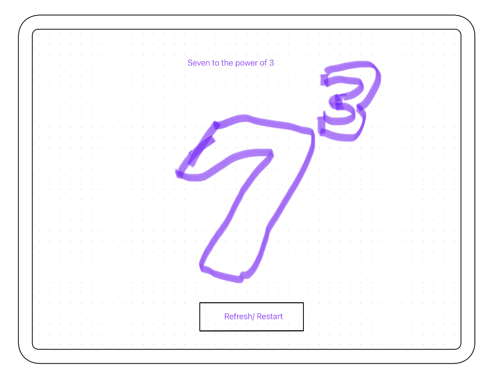

# Wireframes

Below you can see the wireframes created for "2 The Power"

## The Panels

the panels stay the same, though the placement changes depending on screen size

### The Question panel has 2 states

Once the user has chosen the question they want to calculate it will change from the input state to the locked in state

#### Input state

#### Locked in state

### The workings out panel

The workings out panel is designed to scroll across depending on how many iterations the user picks

### The final answer panel

The Final answer panel allows users to skip the workings out section if they wish once they become more advanced and confident

### The answer history Log

This logs each try they complete so they can track what they have done each session

___

## Mobile Wireframes

The mobile first approach, the panels are all displayed in a column in the order that they need to be completed

___

## Ipad/Tablet wireframe

So many of the target audience will use ipads, it stays intuitive and easy to use

___

## Large screens

May be aimed more towards a school setting but many students still utilise laptops and desktops at home, the layout is the same as the ipad/tablet layout but allows more space for the workings out iterations

